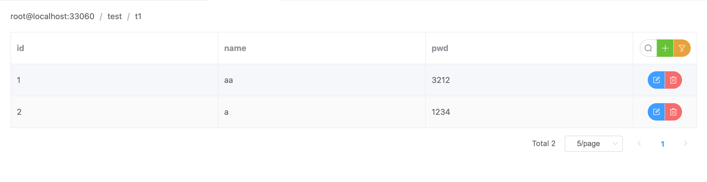
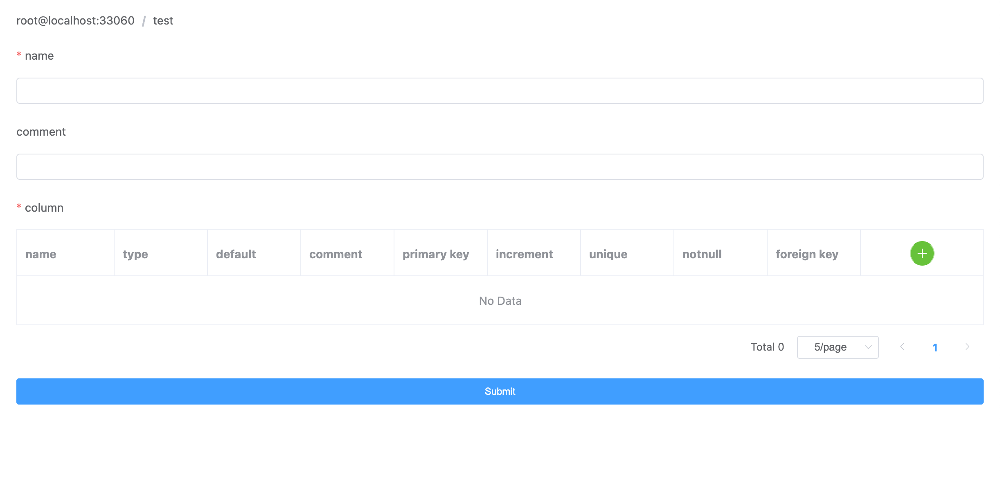
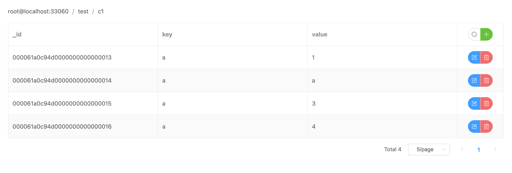
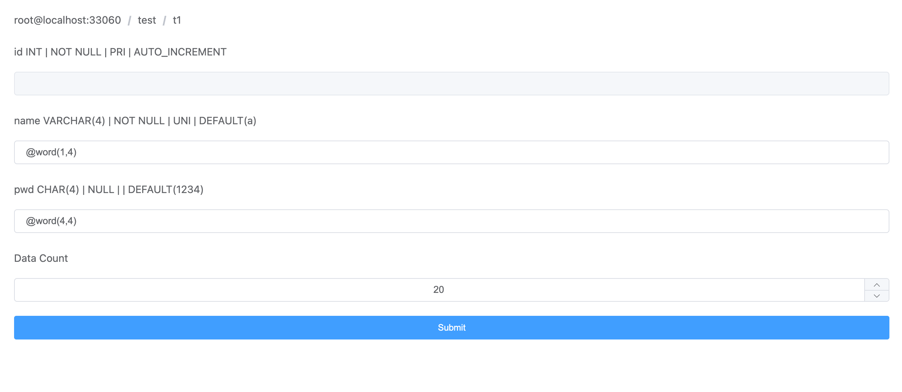
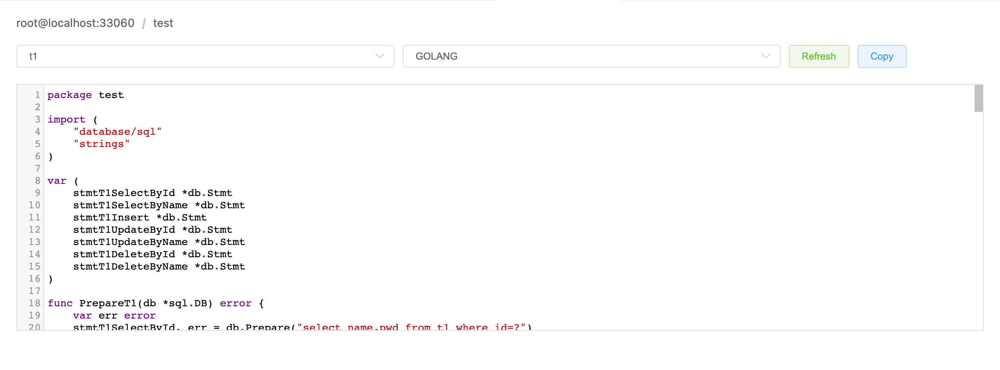

# mysql

This is a simple mysql management tool.

## Features

- Connection Add/Remove.
- Schema Add/Remove.  
- Table Add/Edit/Remove/View.  
  
  
- Collection Add/Remove/View.  
  
- Mock Data.  
  
- Generate Access Code.  
  

## Requirements

This extension use mysql X-DevApi, so you need to enable X plugin.

**Enjoy!**
